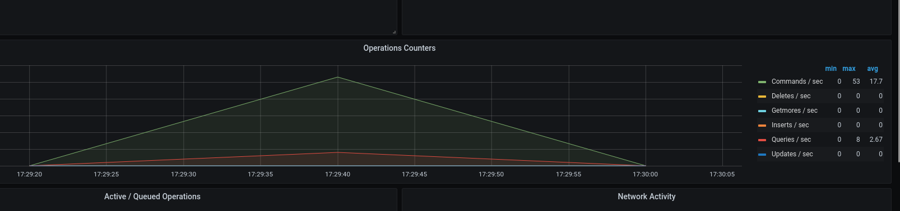
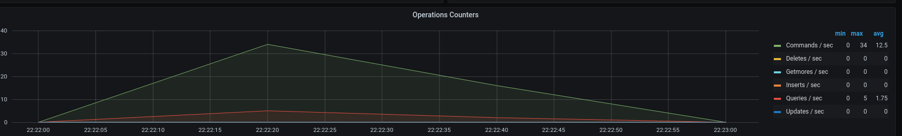
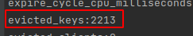

# nosql-database-redis
Configure master-slave redis claster, test all eviction strategy, wrapper for redis cache client 

- run `docker-compose up -d`

- store users throw API call `POST http://localhost:90`

## Test probabilistic cache clearing

* Result using database MongoDB without probabilistic cache clearing

* Result using database MongoDB with probabilistic cache clearing 

## Conclusions
* For case when we use probabilistic cache clearing, we can reduce ~50% using database with 10concurrency requests between 40s. 

## Keys eviction

* For test different Eviction strategy i changed --maxmemory-policy in `redis` container
* Check result in `evicted_keys` from info command

